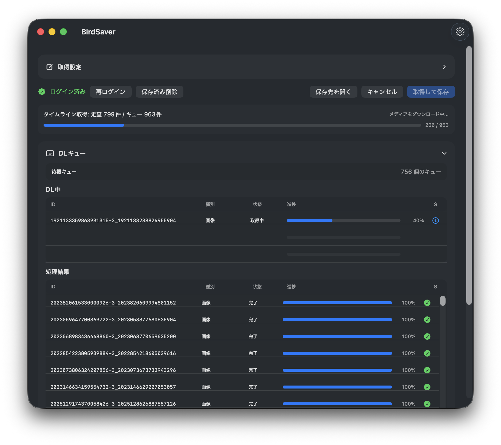

# BirdSaver

BirdSaver は、指定した X（Twitter）ユーザーのタイムラインから画像・動画を収集して保存する macOS 向け SwiftUI アプリです。

## スクリーンショット

### 初期状態


### 取得中


## 主な機能

- X ログイン（WebView）とセッション保持
- ユーザー名 / URL 指定でタイムラインを走査
- 画像・動画の種別フィルタ
- ダウンロードキューの進捗表示
- 保存先フォルダの指定・オープン

## 動作環境

- macOS
- Xcode（Swift / SwiftUI 開発環境）

## セットアップ

```bash
git clone https://github.com/yyyywaiwai/BirdSaver
cd BirdSaver
open BirdSaver.xcodeproj
```

## ビルド（CLI）

```bash
xcodebuild -project BirdSaver.xcodeproj -scheme BirdSaver -configuration Debug build
xcodebuild -project BirdSaver.xcodeproj -scheme BirdSaver -configuration Release build
```

## 使い方

1. アプリ起動後にログインします。
2. 取得対象の `ユーザー名 / URL` を入力します。
3. 画像・動画の対象を選択します。
4. 保存先フォルダを指定して `取得して保存` を押します。
5. `DLキュー` と `処理結果` を確認します。

## 注意事項

- 利用規約・著作権・各種法令を遵守して利用してください。
- トークンや認証情報は Keychain ベースで管理されます。
